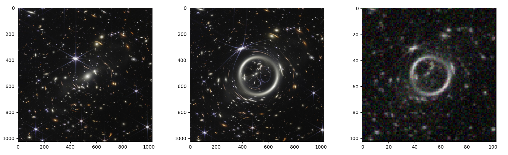

# Gravitational Lensing Simulator

<p align="center">
  
</p>

<p align="center">
  <em>Source plane (left), image plane (middle), detected image with a rather terrible detector (right)</em>
</p>

## About this project

This is a Python project started as a part of my first year of Physics Master, which is an attempt at simulation of gravitational lensing. It is largely based on [arXiv:astro-ph/0604360](https://arxiv.org/abs/astro-ph/0604360). The basic idea is to use a gaussian lens model in order to simulate a lensing effect on an image. I aim to improve this project to have more realistic simulations and useful informations. For now, the project handles one lens and can simulate the optic effects of a detector. Next goals are to handle several lenses, and also compute caustic and critical lines in the image.

## Some physics

The core of the simulation relies on the lens equation, which maps the true position of the source $\vec{\beta}$ to the observed position of the image $\vec{\theta}$:

$$\large\vec{\beta}=\vec{\theta}-\vec{\alpha}(\vec{\theta})$$

where $\vec{\alpha}$ is the scaled deflection angle. 

For a Gaussian surface mass density profile, the convergence (dimensionless surface mass density $\kappa$) is given by:

$$\large\kappa(r)=\frac{M}{2\pi\Sigma_c\sigma^2}e^{-\frac{r^2}{2\sigma^2}}$$

where:
* $M$ is the total mass of the lens.
* $\Sigma_c$ is the critical surface mass density.
* $\sigma$ is the standard deviation (scale length) of the Gaussian profile.
* $r=\sqrt{(x-x_0)^2+(y-y_0)^2}$ is the distance from the center of the lens.

The corresponding deflection field $\vec{\alpha}$ at a distance $r$ from the lens center can be analytically computed as:

$$\large \vec{\alpha}(\vec{r})=\frac{M}{\pi\Sigma_c r^2}\left(1-e^{-\frac{r^2}{2\sigma^2}}\right)(\vec{r}-\vec{r}_s)$$

The `raycaster` function computes this backward mapping for every pixel in the field of view to simulate the lensed image. The simulator also computes the inverse magnification map $\mu^{-1}$ based on the shear $\gamma$ and convergence $\kappa$:

$$\large\mu^{-1}=(1-\kappa)^2-\gamma^2$$


## Structure

```text
gravitational-lensing-simulator/
├── data/               # directory which contains a background source image and a .dat with useful parameters
├── src/                # source code
│   ├── image.py        # image handling functions
│   ├── main.py         # main script and parameter definition
│   └── optics.py       # physics functions
├── LICENSE.md          # MIT license
└── README.md           # this documentation
```


## Installation

1. **Clone the repository:**
   ```bash
   git clone https://github.com/thmspllgr/gravitational-lensing-simulator.git
   cd gravitational-lensing-simulator
   ```

2. **Install dependencies:**
   The project relies on standard scientific Python libraries:
   ```bash
   pip install numpy scipy scikit-image matplotlib
   ```


## Usage

You can start the simulation by running the main execution file in the `src` directory. You can modify the lens parameters (mass $m_p$, scale length $\sigma$, etc.) directly within the script before running.

```bash
python src/main.py
```


## Notes

1. Depending on the chosen arguments in the `initializer` call inside main.py you may be asked to select an image stored on your computer to work with. There may be issues with the image loading process that uses the `Tkinter` library (it comes prepackaged with Python on Windows but not Linux or MacOS). If you encounter issues, for simplicity you can replace the first two lines inside the initializer function after `if case == 'image':` with:
    ```
    image_paths = 'C:/path/to/your/image.png'
    images = [im.imread(image_paths)]
    ```
    And also add `import matplotlib.image as im` at the top of the optics.py file for this to work. This way the only needed function from image.py will be `downsample_image`, which you can also disable by putting `sampling=False` inside the main function, and you can work with the same image for each execution (you can of course choose the one provided in the data folder).

2. The JWST documentation used to get realistic parameters for the simulation can found at:
    - for PSF caracteristics: https://jwst-docs.stsci.edu/jwst-near-infrared-camera/nircam-performance/nircam-point-spread-functions
    - for sampling and noise: https://jwst-docs.stsci.edu/jwst-near-infrared-camera/nircam-instrumentation/nircam-detector-overview

3. This project is licensed under the MIT License - see LICENSE.md for details.
